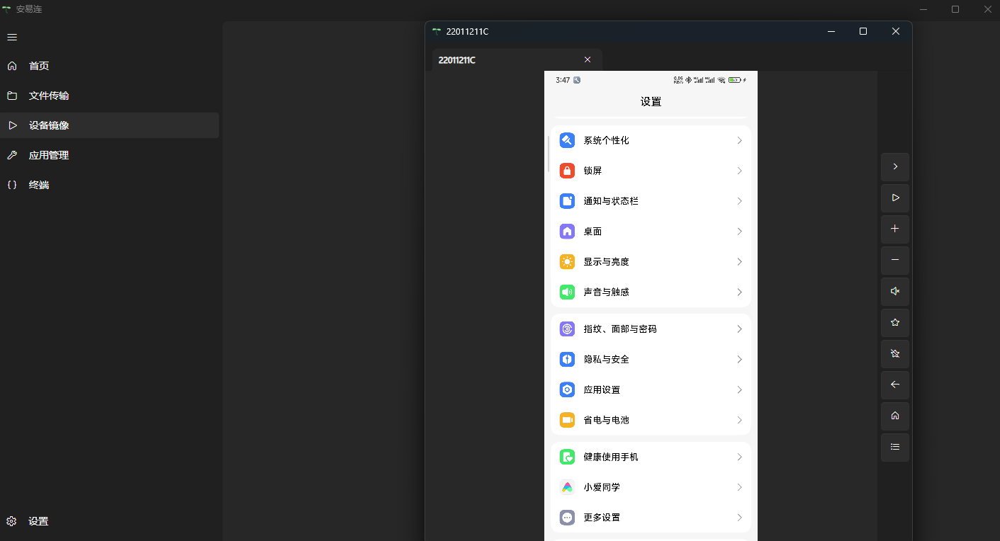
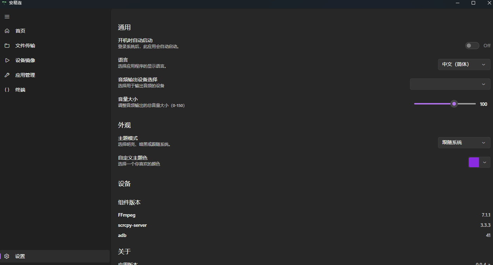
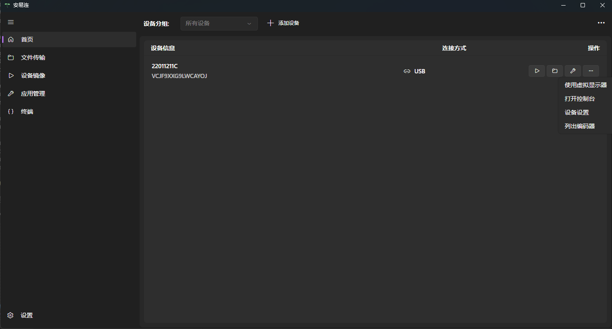

# AYLink
## Cross-Platform Android Screen Mirroring and Control Application

[中文](README.md)

AYLink is a cross-platform, open-source C# application for mirroring and controlling Android devices, built upon [scrcpy](https://github.com/Genymobile/scrcpy). The project utilizes the [Avalonia UI](https://avaloniaui.net/) framework to develop its cross-platform user interface.

> [!NOTE]
> ### Early Stage Notice
> This project is currently in its **early development stage**. It was developed as a hobby project for learning the **Avalonia** framework and **cannot guarantee stability or freedom from errors**.
> If you encounter any issues or have any suggestions, please feel free to provide feedback!

### Platform Support & Publish Commands

This project can be compiled and published for various operating systems and architectures.

| Operating System (OS) | Architecture | Publish Command |
| :--- | :--- | :--- |
| Windows | x64 | `dotnet publish -c Release -r win-x64` |
| Windows | ARM64 | `dotnet publish -c Release -r win-arm64` |
| Linux | x64 | `dotnet publish -c Release -r linux-x64` |
| Linux | ARM64 | `dotnet publish -c Release -r linux-arm64` |
| macOS | x64 (Intel) | `dotnet publish -c Release -r osx-x64` |
| macOS | ARM64 (Apple Silicon) | `dotnet publish -c Release -r osx-arm64` |

On Linux and macOS, you can use a package manager and environment variables to set up ADB and FFmpeg.

### UI Showcase (Dark Mode)

### Custom Background Instructions

After running the application, a `bg` folder will be created in the current directory.

**How to use:** Place your favorite image files into the `bg` folder. The application will automatically select one at random to use as the program's background. This allows you to customize the application's background.

### Third-Party Components & Dependencies

This project relies on the following core third-party components:

| Component | Description and Reference |
| :--- | :--- |
| **ADB** | [AYLink/ADB/README.md](AYLink/ADB/README.md) |
| **FFmpeg** | [AYLink/FFmpeg/README.md](AYLink/FFmpeg/README.md) |
| **Scrcpy** | [AYLink/Scrcpy/README.md](AYLink/Scrcpy/README.md) |

For other detailed project dependencies, please refer to the [AYLink/AYLink.csproj](AYLink/AYLink.csproj) file.