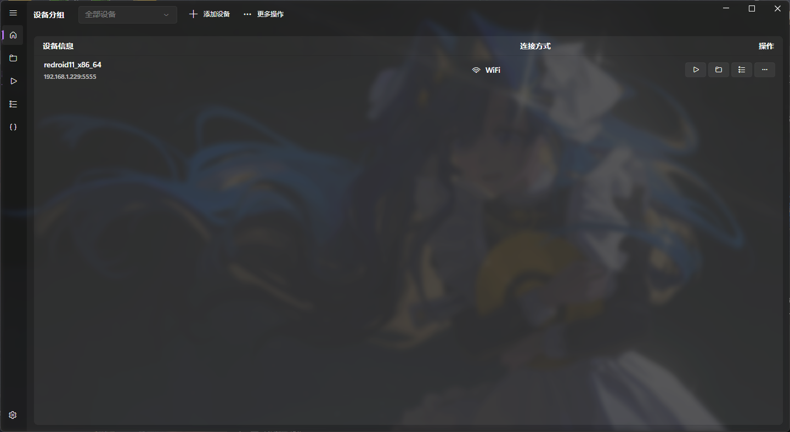
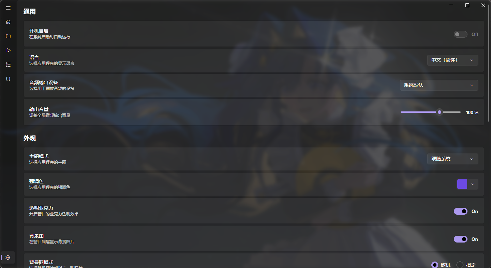
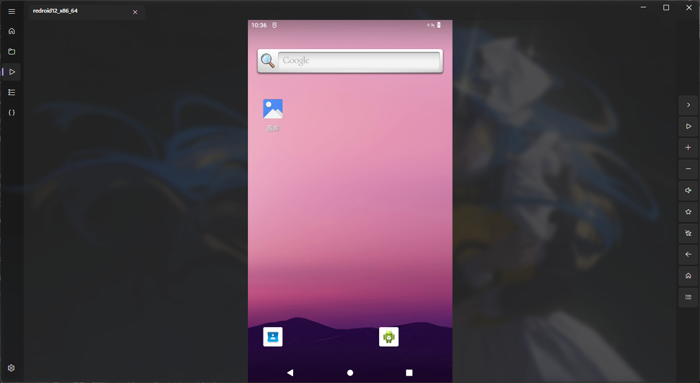
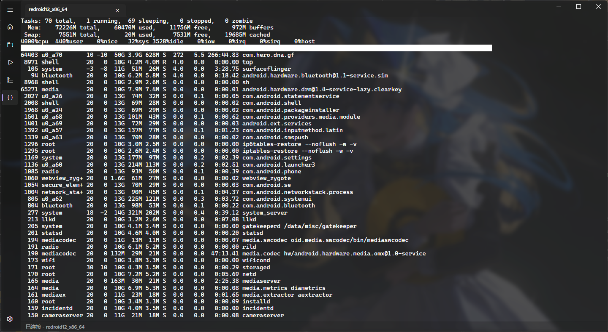

# AYLink (安易连)

**English** | [简体中文](README.md)

**AYLink** is a cross-platform Android device screen mirroring and control client driven by the [scrcpy](https://github.com/Genymobile/scrcpy) core. Written in C# using the [Avalonia UI](https://avaloniaui.net/) framework, this project aims to provide a smooth, beautiful, and multi-platform desktop-level Android device management experience.

> [!TIP]
> This project was originally created as a practice project for learning the Avalonia framework in my spare time. Absolute stability cannot be guaranteed. If you encounter any problems or have good suggestions, please feel free to submit feedback via Issues!

## ✨ Core Features

- **Cross-Platform Support**: Runs perfectly on Windows, macOS, and Linux.
- **Modern Interface**: Smooth UI built with Avalonia, featuring native support for dark mode.
- **Low-Latency Mirroring**: Integrates scrcpy at the core, providing a native-level, high-definition, and low-latency mirroring and control experience.

## 📸 Screenshots

| Main Interface | Feature Settings |
| :---: | :---: |
|  |  |
| **Mirroring Window** | **Terminal** |
|  |  |

## 🚀 Quick Start

### Prerequisites
1. Ensure that **"Developer options"** is enabled on your Android device.
2. Enable **"USB debugging"** within the Developer options.
3. Connect your device to the computer using a USB cable or via Wi-Fi ADB, and authorize debugging permissions for the computer in the pop-up window on your phone.

### Download and Run
Go to [releases](https://github.com/5656565566/AYLink/releases) to download the version that fits your needs.

## 🎨 Advanced Configuration: Custom Background

After running the program for the first time, a `bg` folder will be automatically generated in the current working directory.
**How to set**: Place your favorite image files into this `bg` folder. Every time the program starts, it will automatically select a random image from it to use as the interface background, creating your own personalized workspace.

## 🛠️ Development and Build

If you are a developer and wish to compile this project yourself, it supports local publishing for multiple operating systems and architectures.

### Compilation Command Reference

| Operating System (OS) | Architecture (Arch) | Publish Command |
| :--- | :--- | :--- |
| Windows | x64 | `dotnet publish -c Release -r win-x64` |
| Windows | ARM64 | `dotnet publish -c Release -r win-arm64` |
| Linux | x64 | `dotnet publish -c Release -r linux-x64` |
| Linux | ARM64 | `dotnet publish -c Release -r linux-arm64` |
| macOS | x64 (Intel) | `dotnet publish -c Release -r osx-x64` |
| macOS | ARM64 (Apple Silicon)| `dotnet publish -c Release -r osx-arm64` |

> [!TIP]
> **💡 Linux / macOS Environment Tip**:
> On Linux and macOS systems, it is recommended to use the system's built-in package manager (such as `apt`, `brew`, etc.) to install and configure the environment variables for ADB and FFmpeg, ensuring the program can properly call these dependencies in the background.

## 📦 Dependencies and Acknowledgements

The successful development of this project would not be possible without the following excellent open-source components:

| Project | Description |
|------|------|
| [scrcpy](https://github.com/Genymobile/scrcpy) | Provides core screen mirroring and control capabilities |
| [AdvancedSharpAdbClient](https://github.com/SharpAdb/AdvancedSharpAdbClient) | For easily calling ADB |
| [FFmpeg.AutoGen](https://github.com/Ruslan-B/FFmpeg.AutoGen) | Provides FFmpeg bindings available for C# |
| [Avalonia UI](https://avaloniaui.net/) | A powerful cross-platform .NET UI framework |
| [FluentAvaloniaUI](https://github.com/amwx/FluentAvalonia) | Provides a variety of beautiful controls |
| [SDL3-CS](https://github.com/ppy/SDL3-CS) | Provides SDL3 bindings available for C# |
| [Newtonsoft.Json](https://www.newtonsoft.com/json) | High-performance JSON framework for the .NET platform |
| [XTerm.NET](https://github.com/tomlm/XTerm.NET) | For parsing and processing VT100/ANSI escape sequences |
| [Iciclecreek.Avalonia.Terminal](https://github.com/tomlm/Iciclecreek.Avalonia.Terminal) | Used part of its source code to implement terminal controls |

## 📄 License

This project is open-sourced under the [Apache-2.0 license](../LICENSE).